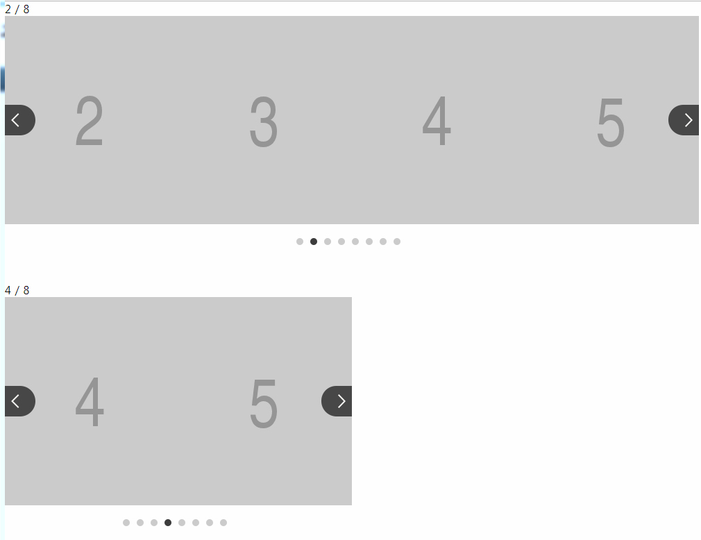

### [ < 홈으로](https://github.com/netfolder/public_chunjae)

## slick
	
```javascript
//기본설정
$(".slick").slick({
	autoplay : false, /* 자동 플레이여부 */
	dots: true, /* 페이지네이션 여부 */
	speed : 500, /* 이미지가 슬라이딩시 걸리는 시간 */
	arrows :true, /* 좌우 방향 버튼 */
	infinite: true, /* 끝없는 좌우 롤링 */
	autoplaySpeed: 3000, /* 이미지가 다른 이미지로 넘어 갈때의 텀 */
	arrows: true, /* 좌우 방향 버튼여부 */
	slidesToShow: pagePerView, /* 화면에 보이는계수 */
	slidesToScroll: 1, /* 한번에 몇개씩 이동할지 */
	fade: false
});
```
##### [옵션더보기 ↓](#option)
	
 - type1[ (소스보기) ](https://github.com/netfolder/public_chunjae/blob/master/slick/html/slick_type1.html)
 
 	
	
